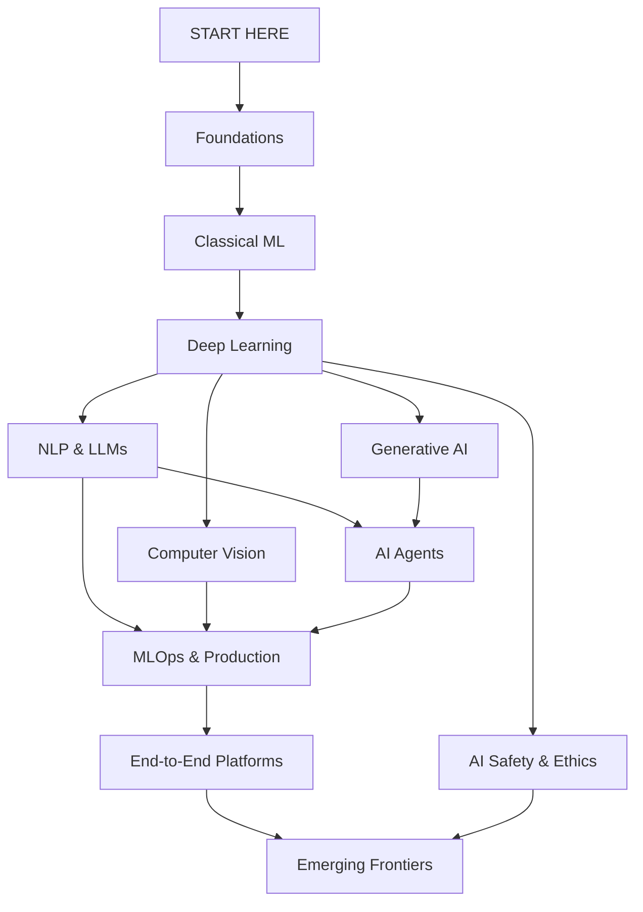

# AI & Machine Learning Roadmap

**The open-source roadmap to mastering AI and Machine Learning** — from mathematical foundations to AI agents, large language models, and production systems. Curated resources, project ideas, and visual learning paths.

> [!TIP]
> Star this repo to keep it in your GitHub feed. New tracks and resources are added regularly.

---

## Roadmap Overview

---

## Table of Contents

- [Learning Tracks](#learning-tracks)
  - [Foundations](#-foundations)
  - [Classical Machine Learning](#-classical-machine-learning)
  - [Deep Learning](#-deep-learning)
  - [NLP & Large Language Models](#-nlp--large-language-models)
  - [Computer Vision](#-computer-vision)
  - [Generative AI](#-generative-ai)
  - [AI Agents & Autonomous Systems](#-ai-agents--autonomous-systems)
  - [MLOps & Production AI](#-mlops--production-ai)
  - [End-to-End AI Platforms](#-end-to-end-ai-platforms)
  - [AI Safety & Ethics](#-ai-safety--ethics)
  - [Emerging Frontiers](#-emerging-frontiers)
- [Resources](#resources)
- [How to Use This Roadmap](#how-to-use-this-roadmap)
- [Contributing](#contributing)
- [License](#license)

---

## Learning Tracks

Each track contains a detailed guide with concepts to learn, curated resources, project ideas, and recommended tools. Click on a track to dive in.

### [Foundations](tracks/01-foundations/README.md)

> Mathematics, Python, data literacy, and the building blocks for everything that follows.

| Topic | What You'll Learn |
|---|---|
| Linear Algebra | Vectors, matrices, eigenvalues, SVD |
| Calculus & Optimization | Gradients, chain rule, gradient descent |
| Probability & Statistics | Distributions, Bayes' theorem, hypothesis testing |
| Python for Data Science | NumPy, Pandas, Matplotlib, Jupyter |
| Data Wrangling | Cleaning, feature engineering, EDA |

**Project Ideas:** Exploratory data analysis portfolio, statistical hypothesis testing suite, data pipeline builder

---

### [Classical Machine Learning](tracks/02-classical-ml/README.md)

> Supervised and unsupervised learning, the algorithms that started it all.

| Topic | What You'll Learn |
|---|---|
| Supervised Learning | Linear/logistic regression, SVMs, decision trees, ensemble methods |
| Unsupervised Learning | K-means, DBSCAN, PCA, t-SNE |
| Model Evaluation | Cross-validation, ROC/AUC, bias-variance tradeoff |
| Feature Engineering | Selection, extraction, encoding, scaling |
| AutoML | Automated model selection and hyperparameter tuning |

**Project Ideas:** Titanic survival predictor, customer churn classifier, housing price estimator, recommendation engine

---

### [Deep Learning](tracks/03-deep-learning/README.md)

> Neural networks from scratch to state-of-the-art architectures.

| Topic | What You'll Learn |
|---|---|
| Neural Network Fundamentals | Perceptrons, backpropagation, activation functions |
| CNNs | Convolutions, pooling, ResNet, EfficientNet |
| RNNs & Sequences | LSTMs, GRUs, sequence-to-sequence models |
| Transformers | Self-attention, positional encoding, the architecture that changed AI |
| Training at Scale | Mixed precision, distributed training, gradient accumulation |

**Project Ideas:** Build a neural network from scratch, image classifier with CNNs, stock price forecaster with LSTMs

---

### [NLP & Large Language Models](tracks/04-nlp-and-llms/README.md)

> From text processing to building and deploying LLM-powered applications.

| Topic | What You'll Learn |
|---|---|
| Text Fundamentals | Tokenization, embeddings, TF-IDF, Word2Vec |
| Transformer Models | BERT, GPT, T5, encoder vs decoder architectures |
| LLM Fine-tuning | SFT, LoRA, QLoRA, RLHF, DPO, GRPO |
| RAG | Retrieval-augmented generation, vector databases, chunking strategies |
| Prompt Engineering | System prompts, few-shot learning, chain-of-thought, context engineering |
| LLM Serving | vLLM, TGI, Ollama, quantization (GGUF, AWQ, GPTQ) |

**Project Ideas:** Sentiment analysis system, RAG chatbot over your documents, multilingual NLP pipeline, LLM-powered code reviewer

---

### [Computer Vision](tracks/05-computer-vision/README.md)

> Teaching machines to see — from image classification to multimodal understanding.

| Topic | What You'll Learn |
|---|---|
| Image Classification | CNNs, transfer learning, data augmentation |
| Object Detection | YOLO, Faster R-CNN, anchor-based vs anchor-free |
| Segmentation | Semantic, instance, and panoptic segmentation (SAM) |
| Video Understanding | Optical flow, action recognition, video transformers |
| Vision-Language Models | CLIP, LLaVA, Florence, visual question answering |

**Project Ideas:** Real-time face recognition, image classification system, object detection for custom datasets, visual search engine

---

### [Generative AI](tracks/06-generative-ai/README.md)

> Creating new content — text, images, audio, video, and code.

| Topic | What You'll Learn |
|---|---|
| Image Generation | GANs, VAEs, diffusion models, Stable Diffusion, Flux |
| Text Generation | Autoregressive models, sampling strategies, beam search |
| Audio & Music | Text-to-speech, voice cloning, music generation |
| Video Generation | Sora 2, Veo 3, Kling 3, temporal consistency |
| Code Generation | Copilot-style tools, code LLMs, benchmark evaluation |
| Multimodal Generation | Text-to-image, image-to-text, any-to-any models |

**Project Ideas:** Image generation with GANs, style transfer app, AI music composer, text-to-image prompt playground

---

### [AI Agents & Autonomous Systems](tracks/07-ai-agents/README.md)

> Building AI systems that reason, plan, use tools, and act autonomously.

| Topic | What You'll Learn |
|---|---|
| Agent Fundamentals | ReAct pattern, tool use, function calling |
| Agent Frameworks | LangChain, LangGraph, CrewAI, AutoGen, Smolagents |
| Agentic RAG | Query decomposition, tool routing, verification loops |
| Multi-Agent Systems | Orchestration, delegation, inter-agent communication |
| MCP | Model Context Protocol for standardized tool integration |
| Agent Evaluation | Benchmarks, sandboxing, reliability metrics |

**Project Ideas:** Web research agent, coding assistant, multi-agent debate system, automated data analysis pipeline

---

### [MLOps & Production AI](tracks/08-mlops-production/README.md)

> Taking models from notebooks to reliable, scalable production systems.

| Topic | What You'll Learn |
|---|---|
| Experiment Tracking | MLflow, Weights & Biases, Trackio |
| Model Serving | TorchServe, Triton, BentoML, FastAPI |
| Containerization | Docker, Kubernetes for ML workloads |
| CI/CD for ML | Testing pipelines, automated retraining, GitHub Actions |
| Monitoring | Data drift detection, model performance monitoring |
| Feature Stores | Feast, Tecton, online vs offline features |
| LLMOps | LLM-specific deployment, caching, cost optimization |

**Project Ideas:** End-to-end ML pipeline with MLflow, model API with FastAPI + Docker, automated retraining system

---

### [End-to-End AI Platforms](tracks/11-end-to-end-platforms/README.md)

> From data to deployed model — cloud, managed, and local deployment paradigms.

| Topic | What You'll Learn |
|---|---|
| Cloud ML Platforms | AWS SageMaker, GCP Vertex AI, Azure ML — full managed pipelines |
| Managed / Serverless | Hugging Face, Replicate, Modal, Together AI, Groq — ship fast |
| Local / Self-Hosted | Ollama, llama.cpp, LM Studio, LocalAI — privacy and control |
| Workflow Patterns | The end-to-end loop across platforms, cost decision frameworks |

**Project Ideas:** Deploy a model on 3 platforms, local RAG system with Ollama, production LLM gateway router

---

### [AI Safety & Ethics](tracks/09-ai-safety-ethics/README.md)

> Building AI systems that are reliable, fair, and aligned with human values.

| Topic | What You'll Learn |
|---|---|
| Alignment | RLHF, constitutional AI, reward modeling |
| Interpretability | SHAP, LIME, attention visualization, mechanistic interpretability |
| Bias & Fairness | Detecting and mitigating bias, fairness metrics |
| Red Teaming | Adversarial attacks, jailbreaking, robustness testing |
| Governance | Responsible AI frameworks, regulations (EU AI Act), model cards |
| Privacy | Differential privacy, federated learning, data anonymization |

**Project Ideas:** Bias detection toolkit, model interpretability dashboard, adversarial robustness tester

---

### [Emerging Frontiers](tracks/10-emerging-frontiers/README.md)

> The cutting edge — where AI is heading next.

| Topic | What You'll Learn |
|---|---|
| Multimodal AI | Vision-language models, any-to-any architectures |
| Robotics & Embodied AI | Simulation, control, real-world deployment |
| AI for Science | Protein folding (AlphaFold), drug discovery, materials science |
| Reinforcement Learning | Policy gradients, PPO, RLHF, game-playing agents |
| World Models | Simulation, predictive models, model-based RL |
| Edge AI | On-device inference, model compression, TinyML |

**Project Ideas:** Reinforcement learning game agent, scientific paper analyzer, edge-deployed image classifier

---

## Resources

Curated collections to accelerate your learning:

| Resource | Description |
|---|---|
| [Tools & Frameworks](resources/tools.md) | The essential AI/ML toolbox — libraries, platforms, and services |
| [Must-Read Papers](resources/papers.md) | Foundational and cutting-edge research papers |
| [Courses](resources/courses.md) | Best free and paid courses from top universities and platforms |
| [Books](resources/books.md) | Recommended reading from beginner to advanced |
| [Datasets](resources/datasets.md) | Where to find datasets for your projects |

---

## How to Use This Roadmap

1. **Follow the tracks in order** if you're starting from scratch — each builds on the previous
2. **Jump to any track** if you already have the prerequisites
3. **Pick project ideas** from each track to build your portfolio
4. **Use the resources** section to find courses, papers, and tools
5. **Contribute** by suggesting new resources, fixing errors, or adding project ideas

> [!NOTE]
> You don't need to complete every topic in a track before moving on. The roadmap is a guide, not a checklist. Focus on what interests you and build projects along the way.

---

## Contributing

Contributions are welcome! Whether it's adding a new resource link, suggesting a project idea, fixing a typo, or proposing an entirely new track — every contribution helps.

Read the [CONTRIBUTING.md](CONTRIBUTING.md) for guidelines.

### Ways to Contribute
- Add or update resource links
- Suggest new project ideas
- Improve track descriptions
- Fix errors or outdated information
- Translate content to other languages

---

## License

This project is licensed under the [MIT License](LICENSE).

---

**If you find this roadmap useful, give it a star — it helps others discover it too.**
