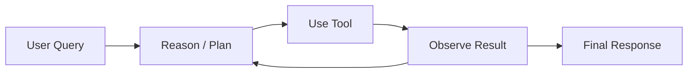

# AI Agents & Autonomous Systems

> Building AI systems that reason, plan, use tools, and act autonomously — the most transformative application of LLMs.

**Prerequisites:** [NLP & LLMs](../04-nlp-and-llms/README.md) — understanding of LLMs, prompting, and RAG.

---

## Core Concepts

### Agent Fundamentals

What makes an LLM into an agent: the ability to reason, plan, and act.

| Concept | Description |
|---|---|
| ReAct Pattern | Interleaving reasoning and actions — think, then act, then observe |
| Tool Use / Function Calling | Letting LLMs invoke external tools (APIs, code, databases) |
| Planning | Breaking complex tasks into subtasks |
| Memory | Short-term (conversation), long-term (persistent knowledge) |
| Observation Loop | Agent acts, observes results, adjusts strategy |

### Agent Frameworks

The ecosystem for building agents in 2025-2026.

| Framework | Description | Best For |
|---|---|---|
| **LangChain / LangGraph** | Popular framework with graph-based orchestration | Complex multi-step workflows |
| **CrewAI** | Role-based multi-agent framework | Team-based agent collaboration |
| **AutoGen (Microsoft)** | Multi-agent conversation framework | Research, complex reasoning |
| **Smolagents (Hugging Face)** | Lightweight, code-first agents | Simple tool-use agents |
| **OpenAI Agents SDK** | OpenAI's native agent framework | OpenAI model users |
| **Pydantic AI** | Type-safe agent framework | Production-grade agents |
| **Mastra** | TypeScript agent framework | JS/TS developers |

### Agentic RAG

Going beyond basic RAG — agents that decide what to retrieve and how.

| Pattern | Description |
|---|---|
| Query Decomposition | Breaking complex questions into sub-queries |
| Tool Routing | Choosing between vector search, SQL, web search, APIs |
| Iterative Retrieval | Retrieving, evaluating, and retrieving again if needed |
| Verification | Reranking results, checking citations, fact-checking |
| GraphRAG | Using knowledge graphs for multi-hop reasoning |

> [!TIP]
> Agentic RAG is replacing simple RAG pipelines in production. Instead of one fixed retrieval step, the agent decides dynamically what information it needs.

### Multi-Agent Systems

Multiple agents collaborating to solve complex problems.

| Pattern | Description |
|---|---|
| Orchestrator-Worker | One agent delegates to specialized agents |
| Debate / Critique | Agents challenge each other's outputs |
| Pipeline | Sequential processing through specialized agents |
| Hierarchical | Manager agents supervise teams of worker agents |
| Swarm | Decentralized coordination among peer agents |

### Model Context Protocol (MCP)

The emerging standard for connecting LLMs to external tools and data.

| Concept | Description |
|---|---|
| MCP Servers | Expose tools and resources via a standard protocol |
| MCP Clients | LLM applications that connect to MCP servers |
| Tool Discovery | Agents discover available tools dynamically |
| Resource Access | Standardized read access to external data |

### Agent Evaluation

How to measure if your agent actually works.

| Metric | What It Measures |
|---|---|
| Task Completion Rate | Does the agent finish the task? |
| Tool Selection Accuracy | Does it pick the right tools? |
| Efficiency | How many steps does it take? |
| Cost | Token usage and API costs per task |
| Safety | Does it stay within bounds? |
| Benchmarks (SWE-bench, GAIA, AgentBench) | Standardized agent evaluations |

---

## Recommended Resources

### Courses
- [DeepLearning.AI — AI Agents in LangGraph](https://www.deeplearning.ai/short-courses/) (free)
- [DeepLearning.AI — Multi AI Agent Systems with CrewAI](https://www.deeplearning.ai/short-courses/) (free)
- [Hugging Face — Agents Course](https://huggingface.co/learn/agents-course) (free)

### Key Papers & Posts
- [ReAct: Synergizing Reasoning and Acting](https://arxiv.org/abs/2210.03629)
- [Toolformer](https://arxiv.org/abs/2302.04761) — teaching LLMs to use tools
- [Generative Agents: Interactive Simulacra](https://arxiv.org/abs/2304.03442)
- [The AI Agents Stack](https://www.anthropic.com/research/building-effective-agents) — Anthropic's guide

### Key Tools
- [LangChain](https://www.langchain.com/) / [LangGraph](https://langchain-ai.github.io/langgraph/)
- [CrewAI](https://www.crewai.com/)
- [Smolagents](https://huggingface.co/docs/smolagents)
- [Browser Use](https://github.com/browser-use/browser-use) — web browser automation for agents
- [MCP](https://modelcontextprotocol.io/) — Model Context Protocol specification

---

## Project Ideas

| Project | Difficulty | Description |
|---|---|---|
| **Web Research Agent** | Intermediate | Agent that searches the web, reads pages, and synthesizes answers |
| **Coding Assistant** | Advanced | Agent that reads codebases, writes code, and runs tests |
| **Multi-Agent Debate System** | Advanced | Multiple agents debate a topic and reach consensus |
| **Automated Data Analysis Pipeline** | Intermediate | Agent that explores a dataset, generates insights, and creates reports |
| **Personal Knowledge Assistant** | Intermediate | Agentic RAG over your notes, docs, and bookmarks |
| **MCP Server Builder** | Advanced | Create custom MCP servers to expose your tools to LLMs |

---

## What's Next?

Learn to deploy your agents reliably in **[MLOps & Production AI](../08-mlops-production/README.md)**, or explore the ethical dimensions in **[AI Safety](../09-ai-safety-ethics/README.md)**.

[Back to Roadmap](../../README.md)
