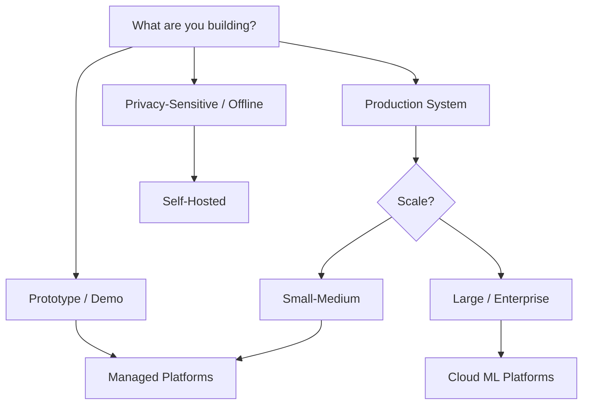
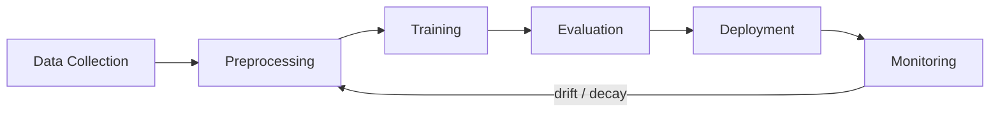

# End-to-End AI Platforms

> From data to deployed model — the platforms and paradigms for shipping AI in the real world.

**Prerequisites:** Familiarity with at least one ML track. [MLOps & Production AI](../08-mlops-production/README.md) covers the underlying concepts (serving, monitoring, CI/CD) that these platforms abstract away.

---

## Choosing Your Deployment Paradigm

There is no single right answer. The best platform depends on your scale, budget, team size, and latency requirements.



| Paradigm | Best For | Tradeoff |
|---|---|---|
| **Cloud ML Platforms** | Enterprise scale, custom training, full control | Higher complexity, vendor lock-in, cost at scale |
| **Managed / Serverless Platforms** | Fast prototyping, small teams, API-first | Less control, usage-based costs can surprise |
| **Local / Self-Hosted** | Privacy, offline use, cost control, experimentation | You manage everything, limited scale |

---

## Cloud ML Platforms

Fully managed, enterprise-grade platforms for the complete ML lifecycle.

### AWS

| Service | Purpose |
|---|---|
| **SageMaker** | End-to-end ML: notebooks, training, tuning, deployment, pipelines |
| **SageMaker JumpStart** | Pre-trained model hub (deploy foundation models in clicks) |
| **Bedrock** | Managed access to foundation models (Claude, LLaMA, Mistral, Titan) |
| **S3 + Glue** | Data storage, cataloging, and ETL |
| **Lambda** | Serverless inference for lightweight models |
| **EC2 (P/G instances)** | Raw GPU compute for custom workloads |

**Typical End-to-End Flow:**
Data in S3 -> SageMaker Processing (clean) -> SageMaker Training -> Model Registry -> SageMaker Endpoint -> CloudWatch Monitoring

### Google Cloud

| Service | Purpose |
|---|---|
| **Vertex AI** | Unified ML platform: training, AutoML, pipelines, prediction |
| **Vertex AI Model Garden** | Deploy open-source and Google models |
| **Gemini API** | Access Gemini models via API |
| **BigQuery ML** | Train models directly in SQL on BigQuery data |
| **Cloud TPUs** | Google's custom ML accelerators |
| **Cloud Storage + Dataflow** | Data storage and processing pipelines |

**Typical End-to-End Flow:**
Data in BigQuery -> Vertex AI Training (custom or AutoML) -> Model Registry -> Vertex AI Endpoint -> Vertex AI Model Monitoring

### Microsoft Azure

| Service | Purpose |
|---|---|
| **Azure Machine Learning** | Full ML lifecycle: designer, notebooks, pipelines, endpoints |
| **Azure OpenAI Service** | Managed GPT-5, DALL-E, embeddings with enterprise security |
| **Azure AI Studio** | Build and deploy generative AI apps |
| **Azure Databricks** | Collaborative data engineering + ML |
| **Cosmos DB** | Vector search for RAG applications |
| **Azure Kubernetes Service (AKS)** | Container orchestration for custom serving |

**Typical End-to-End Flow:**
Data in Azure Storage -> Azure ML Pipeline (process + train) -> Model Registry -> Managed Endpoint -> Azure Monitor

### Platform Comparison

| Feature | AWS SageMaker | GCP Vertex AI | Azure ML |
|---|---|---|---|
| AutoML | SageMaker Autopilot | Vertex AutoML | Azure AutoML |
| Foundation Models | Bedrock | Model Garden + Gemini API | Azure OpenAI |
| Notebooks | SageMaker Studio | Colab Enterprise / Workbench | Azure ML Notebooks |
| Pipeline Orchestration | SageMaker Pipelines | Vertex AI Pipelines (Kubeflow) | Azure ML Pipelines |
| Custom Training | Training Jobs | Custom Training Jobs | Compute Clusters |
| Serving | Real-time / Async Endpoints | Online / Batch Predictions | Managed / Batch Endpoints |
| Cost Model | Per-instance + storage | Per-node-hour + storage | Per-compute + storage |
| Best Ecosystem Fit | Already on AWS | Already on GCP / BigQuery users | Enterprise / Microsoft shops |

> [!TIP]
> If your organization already uses one cloud provider, start there. The switching cost between providers is high, and most offer comparable ML capabilities.

---

## Managed / Serverless Platforms

Lighter-weight platforms that abstract infrastructure away — ideal for shipping fast.

### Model Hosting & Inference APIs

| Platform | What It Does | Best For |
|---|---|---|
| **Hugging Face** | Model hub, Spaces (demo apps), Inference Endpoints, AutoTrain | Open-source models, community, quick deployment |
| **Replicate** | Run any model via API (pay per prediction) | Trying models without infrastructure |
| **Modal** | Serverless GPU functions in Python | Custom inference and training jobs, batch processing |
| **Together AI** | Fast inference for open-source LLMs | Cost-effective LLM APIs |
| **Fireworks AI** | Optimized LLM inference | Low-latency LLM serving |
| **Groq** | Ultra-fast LLM inference on custom hardware (LPU) | Latency-critical applications |
| **Anyscale** | Managed Ray for scaling ML workloads | Distributed training and serving |

### Demo & Prototyping Tools

| Tool | What It Does | Best For |
|---|---|---|
| **Gradio** | Python library for building ML web UIs in minutes | Quick demos, sharing with stakeholders |
| **Streamlit** | Python framework for data apps | Interactive dashboards, data exploration |
| **Hugging Face Spaces** | Free hosting for Gradio/Streamlit apps | Public demos, portfolio projects |
| **Google Colab** | Free GPU notebooks in the browser | Experimentation, tutorials, sharing |

### End-to-End on Managed Platforms

A typical lightweight pipeline without touching cloud infrastructure:

```
Train on Colab / Modal -> Upload to Hugging Face Hub -> Deploy on Inference Endpoints -> Gradio frontend on Spaces
```

Or for LLM applications:

```
Data in Hugging Face Datasets -> Fine-tune with AutoTrain or Modal -> Serve via Together AI / Groq API -> Gradio UI
```

---

## Local / Self-Hosted

Running AI on your own hardware — for privacy, cost control, or offline use.

### Local LLM Deployment

| Tool | Description | Best For |
|---|---|---|
| **Ollama** | Run LLMs locally with one command | Easiest local setup, development |
| **LM Studio** | Desktop app for running local LLMs with chat UI | Non-technical users, quick testing |
| **llama.cpp** | CPU/GPU inference for GGUF models | Maximum control, edge deployment |
| **LocalAI** | OpenAI-compatible local API | Drop-in replacement for OpenAI API |
| **vLLM** (self-hosted) | High-throughput serving on own GPUs | Production-grade local serving |
| **TGI** (self-hosted) | Hugging Face's inference server | Self-managed model serving |

### Self-Hosted Training

| Approach | Description |
|---|---|
| **Single GPU workstation** | Fine-tuning with LoRA/QLoRA, small model training |
| **Multi-GPU server** | Full fine-tuning, medium-scale training with DeepSpeed/FSDP |
| **On-prem cluster** | Kubernetes + GPUs for team/org-wide ML infrastructure |
| **GPU cloud** (Lambda, RunPod, Vast.ai) | Rent GPUs on demand without cloud platform overhead |

### When Local Makes Sense

| Scenario | Why Local Wins |
|---|---|
| Sensitive data (medical, financial, legal) | Data never leaves your network |
| High-volume inference | Amortized cost is lower than pay-per-call APIs |
| Offline / air-gapped environments | No internet dependency |
| Experimentation and learning | No surprise bills, iterate freely |
| Latency-critical edge deployment | No network round-trip |

> [!IMPORTANT]
> Local deployment doesn't mean you skip MLOps practices. You still need model versioning, monitoring, and reproducibility — you just manage the infrastructure yourself.

---

## End-to-End Workflow Patterns

Regardless of platform, every ML project follows a similar loop:



### The Same Workflow, Different Platforms

| Step | AWS | GCP | Azure | Hugging Face | Local |
|---|---|---|---|---|---|
| **Data** | S3 + Glue | BigQuery + GCS | Azure Storage + Databricks | HF Datasets | Local filesystem |
| **Train** | SageMaker Training | Vertex AI Training | Azure ML Compute | AutoTrain / Modal | PyTorch + GPU |
| **Evaluate** | SageMaker Experiments | Vertex AI Experiments | Azure ML Metrics | HF Evaluate | MLflow |
| **Deploy** | SageMaker Endpoints | Vertex AI Endpoints | Managed Endpoints | Inference Endpoints | Ollama / vLLM |
| **Monitor** | CloudWatch | Vertex AI Monitoring | Azure Monitor | Manual / custom | Prometheus + Grafana |

### Cost Decision Framework

| Budget | Team Size | Recommendation |
|---|---|---|
| $0 | Solo | Google Colab + Hugging Face Spaces + Ollama |
| $50-200/mo | Solo-Small | Modal / Together AI + Hugging Face |
| $500-2000/mo | Small team | Managed cloud (SageMaker / Vertex AI / Azure ML) |
| $2000+/mo | Team / Org | Cloud platform + dedicated GPU instances |
| One-time hardware | Any | Local GPU workstation (RTX 4090 / A6000) |

---

## Recommended Resources

### Courses & Docs
- [AWS SageMaker Documentation](https://docs.aws.amazon.com/sagemaker/) (free)
- [Google Vertex AI Documentation](https://cloud.google.com/vertex-ai/docs) (free)
- [Azure ML Documentation](https://learn.microsoft.com/en-us/azure/machine-learning/) (free)
- [Hugging Face Course](https://huggingface.co/learn) (free)
- [Modal Documentation](https://modal.com/docs) (free)
- [DeepLearning.AI — Serverless LLM Apps on AWS](https://www.deeplearning.ai/short-courses/) (free)

### Certifications (if relevant to your career)
- AWS Machine Learning Specialty
- Google Cloud Professional Machine Learning Engineer
- Azure AI Engineer Associate

---

## Project Ideas

| Project | Difficulty | Description |
|---|---|---|
| **Deploy a Model on 3 Platforms** | Beginner | Take a trained model and deploy it on SageMaker, Vertex AI, and HF Inference Endpoints to compare |
| **Gradio App on Hugging Face Spaces** | Beginner | Build and deploy an interactive ML demo |
| **Serverless Training Pipeline** | Intermediate | Use Modal to train a model on demand and serve it via API |
| **Multi-Cloud ML Pipeline** | Advanced | Build the same pipeline on AWS and GCP, compare cost and complexity |
| **Local LLM Chat** | Beginner | Set up Ollama + Open WebUI for a fully local ChatGPT alternative |
| **RAG on Your Documents (Local)** | Intermediate | Build a fully private RAG system with Ollama + ChromaDB |
| **Production LLM Gateway** | Advanced | Build a router that sends queries to the cheapest/fastest provider (Groq, Together, OpenAI) |

---

## What's Next?

Now that you can ship end-to-end, explore the cutting edge in **[Emerging Frontiers](../10-emerging-frontiers/README.md)**, or ensure your deployments are responsible with **[AI Safety & Ethics](../09-ai-safety-ethics/README.md)**.

[Back to Roadmap](../../README.md)
